# Atmos GL

## What is this?

A Docker Compose–based system that gives you a live, interactive 3D globe in your browser —
built on MapLibre GL JS — showing real-time and forecast weather and world events: clouds,
isobars, wind, precipitation, precipitable water (moisture), sea surface temperature, ocean
currents, wave height, air temperature, ozone, storm watch (CAPE/CIN), earthquakes, volcanoes,
tropical storms, lightning strikes, shipping traffic, satellites and more.

A Python/FastAPI backend continuously pulls forecast data from NOAA/NCEP (GFS atmospheric and
wave models, RTOFS ocean currents) and live event feeds (USGS earthquakes, NOAA/NHC/JTWC storm
tracks, Smithsonian volcano data, AIS shipping, lightning strikes, satellite orbits), storing
everything in PostGIS and rendering it onto the globe as you watch.

### Our Blue Marble
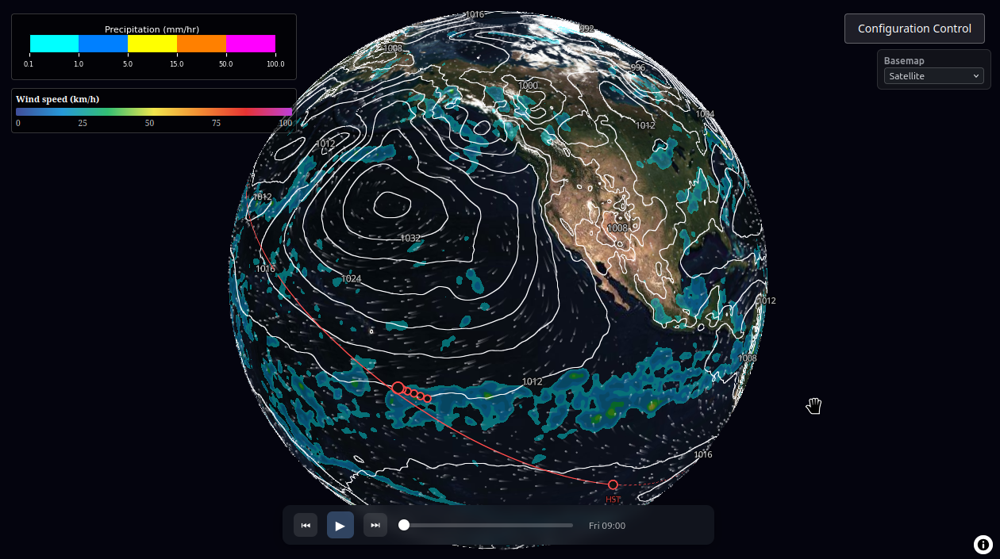

## Quick Start

### Prerequisites: Docker Installation

Before running this project, you must have Docker and Docker Compose installed on your system.
For Ubuntu users, it is highly recommended to install Docker via the official Docker repository
rather than the default apt archives to ensure you have the latest version compatible with
modern systemd and container features. You can verify your installation by running
docker --version in your terminal.

If you need some guidance on this a good place to look is
here https://www.digitalocean.com/community/tutorials/how-to-install-and-use-docker-on-ubuntu-20-04

Despite the '20-04' at the end of the link, this tutorial is also fine for later versions of Ubuntu.

To avoid having to use sudo with every command, ensure your user is added to the docker group.
After installation, run `sudo usermod -aG docker $USER` and log out and back in for the changes
to take effect. This will allow you to manage containers and orchestration seamlessly while
working within the repository.

Everything here is Docker-based, so while these instructions lean Linux, it should run
wherever Docker Desktop does.

### Install and Run

Run this to download everything needed and set it up in `~/atmos-gl` (pass a path as
an argument if you'd rather install somewhere else):

    curl -fsSL https://raw.githubusercontent.com/paulwaite87/atmos-gl/master/install.sh | bash

This fetches `docker-compose.yml`, an `atmos-gl.sh` control script, and the reference
data the map needs, then creates a `.env` and `config/atmos-gl.json` for you (both
left alone on future re-runs, so it's always safe to run this again later to pick up
updates to everything else).

Edit `.env` and fill in your API keys — see [Map Tiles API Key](#map-tiles-api-key),
[Shipping Data API Key](#shipping-data-api-key),
[Lightning Strikes API Key](#lightning-strikes-api-key),
[NASA FIRMS API Key](#nasa-firms-api-key)

The map tiles key is MANDATORY for the globe's basemap to render at all. Shipping and lightning 
are optional (you can enable them later once you have keys).

Then start everything:

    cd ~/atmos-gl
    ./atmos-gl.sh start

By default most layers are disabled to begin with — see [Setting it Up](#setting-it-up) below.

To stop everything:

    ./atmos-gl.sh stop

`atmos-gl.sh` also has `restart`, `update` (pulls the latest images), `status` (ship/lightning
counts per region) and `logs` commands — run it with no arguments for the full list. If you
ever need to report a problem, `./atmos-gl.sh logs save` writes a timestamped log file with
any API keys automatically redacted, safe to attach to a GitHub issue.

(If you've cloned the repo instead of using the installer, the Makefile has equivalents for
all of this — see [Developer's Corner](#developers-corner) below.)

### Setting it Up
The configuration file is called `atmos-gl.json` and it lives in the `config` folder.
You can either edit this file directly, or browse to `http://localhost:9000/config` to use
the configuration webpage there. If you do use that page, and save some changes they
will overwrite your `atmos-gl.json` — which is fine, but if you want to preserve your own
hand-edits, make a backup copy of the file first.

The live globe itself is at `http://localhost:8180`.

Here is a shot of the homepage for the configurator at `http://localhost:9000/config`

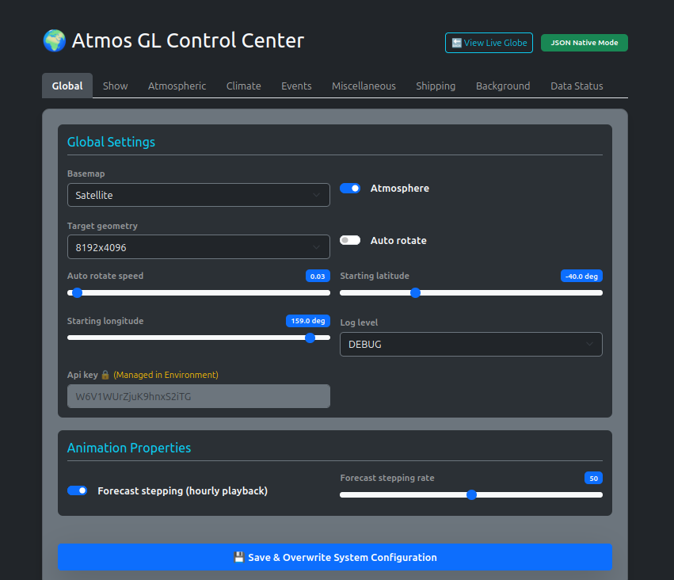

I would suggest first setting your starting Latitude and Longitude to a view you want to
see at startup and then in the `Show` tab just enabling some of the atmospheric layers
like `Isobars`, `Wind` and `Preciptation` as a starting point.

If you change something in `config/atmos-gl.json` by hand rather than through the web UI,
restart the backend to pick it up:

    ./atmos-gl.sh restart

### API Keys
Some of the data resources we are lucky enough to have free access to are only available
if you have an API Key. This is perfectly reasonable because it allows the folks running
and maintaining the resource to rate-limit data being served. None of the API Keys used
in this project are hard to obtain, but even so it is entirely optional apart from the
first one below, which is needed for you to see the map.

#### Map Tiles API Key
This is MANDATORY.
The globe's basemap imagery (satellite/street tiles) is served by MapTiler, and needs its own
free API key. Sign up at https://www.maptiler.com/, grab a key from your account dashboard,
and put it in `.env` as `MAPTILER_API_KEY`. Without this the globe has nothing to render its
basemap with.

#### Shipping Data API Key
This is optional.
The `shipping_collector` needs an API Key to access the AIS stream carrying shipping messages.

To obtain one, head on over to https://aisstream.io/documentation on that page you will see
a link to `Sign In` (https://aisstream.io/authenticate) which will ask you to sign in to their
Github. Obviously if you don't have a Github account you will have to sign up for that first.

The process of obtaining the API Key is easy once you are signed in. There is a link `API Keys`
and you can create one there. Copy the key, and then back in the root directory edit the
file named `.env` and replace the `AIS_API_KEY` placeholder there with your newly minted
API Key. You will now be able to go into the Atmos GL Configurator and on the `Show` tab
in the `Background Processes` group enable either or both the Shipping and Lightning processes.

#### Lightning Strikes API Key
This is optional.
It is the API keyfor the `lightning_collector` and it's a similar deal, but also easy. 
You just need to create an account on https://openweathermap.org and the link to acquire 
an API Key is right there on the homepage. Just be aware it will take some hours before 
the key is made active.

In your `.env` file do as above and put the key in for the `OPENWEATHER_API_KEY` setting.
No quotes around the key are required.

Once the `lightning_collector` process is enabled and running, you will find that the table
in the database called `lightning_strikes` will acquire data, though it also gets culled
every few hours (`strike_expiry_hours` setting in that section) so won't get too populated.

#### NASA FIRMS API Key
This is optional.
It's for the `Wildfires` layer, sourced from NASA's FIRMS (Fire Information for Resource
Management System) — near-real-time active-fire detections from satellite, updated
roughly hourly.

Sign up for a free key at https://firms.modaps.eosdis.nasa.gov/api/map_key/ — just an
email address, no approval wait, the key is generated and emailed to you instantly.
Back in the root directory edit `.env` and put the key in for the `FIRMS_API_KEY`
setting, same as the others above.

With climate change seemingly setting various regions of the planet on fire, this one
is a really informative layer to have running. Once the key is in place, enable
`Wildfires` in the Atmos GL Configurator's `Show` tab, under the `Events` group.

### Forecasting
The map has a time scrubber built right into it — play, step forward/back, or drag through
the available forecast hours (configurable, default 24) for any layer that supports 
forecasting. The most useful elements which will show forecasts are of course Precipitation, 
Precipitable Water and Isobars, but others will do so as well such as Stormwatch, Temperature,
Waves and Wind. A notable exception is Clouds which are really only eye-candy as far as 
meteorology is concerned. They are built up over 24 hours as photo swathes by the polar 
orbiting NOAA satellites, so are not computed out into the future like the above datasets. 
The Global tab also has forecast-stepping controls that let you play forward through upcoming 
hours automatically.

For the elements which support forecasting, the number of hours into the future which you
can display is a configurable property of the `Data Collector`. In the configuration UI
screen go to the `Background` tab, and it is the `Cache hours` setting under
`Data Collector Properties`.

### Day and Night
There is a `Terminator` layer (in the `Show` tab's `Miscellaneous` group) which shades the
night side of the globe with a soft transition at the terminator line, for a realistic view
of what's happening on the planet day and night. It has its own opacity, colour and edge
softness settings if you'd like to tune the look, and can simply be switched off if you'd
rather have an unshaded view of whatever layers you have enabled.

### Watching It Work
To tail the logs of everything:

    ./atmos-gl.sh logs

Or just one service:

    ./atmos-gl.sh logs layer_builder

A healthy log might look something like this.
    
    data_collector-1       | 2026-07-11 08:57:09,922 [INFO] atmos_gl.collectors.gfs_atmos: Data Collector (gfs): 20260710 12Z, hours 009..056; stored 8 field(s).
    data_collector-1       | 2026-07-11 08:57:13,713 [INFO] atmos_gl.collectors.gfs_waves: Data Collector (waves): 20260710 12Z, hours 009..056; stored 1 field(s).
    layer_builder-1        | 2026-07-11 09:00:38,398 [INFO] atmos_gl.tasks.common: currents: rendered 1 hour(s) (51 available, stopped early after 7 examined).
    layer_builder-1        | 2026-07-11 09:00:39,710 [INFO] atmos_gl.tasks.waves: Waves: wrote swell velocity texture f018.
    layer_builder-1        | 2026-07-11 09:00:39,803 [INFO] atmos_gl.tasks.common: waves: rendered 1 hour(s) (49 available, stopped early after 11 examined).
    layer_builder-1        | 2026-07-11 09:00:41,787 [INFO] atmos_gl.tasks.isobars: Finished Isobars texture f019.
    layer_builder-1        | 2026-07-11 09:00:41,827 [INFO] atmos_gl.tasks.common: isobars: rendered 1 hour(s) (49 available, stopped early after 12 examined).
    layer_builder-1        | 2026-07-11 09:00:56,080 [INFO] atmos_gl.tasks.precipitation: Finished Precipitation texture f019 (low smoothing).
    layer_builder-1        | 2026-07-11 09:00:56,714 [INFO] atmos_gl.tasks.common: precipitation: rendered 1 hour(s) (49 available, stopped early after 12 examined).
    layer_builder-1        | 2026-07-11 09:03:38,143 [INFO] atmos_gl.tasks.scalar_field: Finished temperature texture f019.

The `data_collector` continuously fetches fresh data in the background regardless of
which layers you have switched on, so it's ready the moment you enable something. The
`layer_builder` is what turns collected data into the images/textures the globe actually
displays, cycling through every enabled layer, one forecast hour at a time, so all your
enabled layers make visible progress together rather than one finishing its whole backlog
before the next one starts.

For ship/lightning counts per region, run:

    ./atmos-gl.sh status

### Starting Fresh
If you really want a fresh start, stop the stack and remove the contents of the `data`
folder — you may need `sudo` depending on how your containers are set up.

## Map Layers
Apart from shipping there are, of course, other elements to the map display.
The full list is:

* Clouds
* Isobars
* Wind speed & direction
* Precipitation
* Precipitable water (atmospheric moisture)
* Sea surface temperature
* Ocean currents
* Wave height & direction
* Air temperature
* Ozone layer density
* Storm watch
* Lightning strikes
* Active storms
* Earthquakes
* Volcanoes
* Shipping
* Flight Radar
* Satellites
* Place markers

Each of these has its own configuration options.

Hopefully the settings in each section are fairly self-explanatory.

In the web configuration UI, the `Show` tab controls what gets shown on the map. If 
something is disabled, then the following tabs will show that section disabled, to avoid 
cluttering the interface.

The data for these elements is also updated according to a frequency determined by a 
`Runs per day `setting. This is to restrict load on the remote servers, which only update 
their data every few hours at most anyway. Data collection itself, though, always runs in the
background regardless of whether a layer is switched on — so the moment you enable
something it's ready to display rather than waiting for a fresh fetch.

### Atmospheric
This group loosely comprises day-to-day atmospheric activity. We generally just lump
this into the category "weather", and the layers we have here are usually the most
interesting from the point of view of direct daily impact on our activities.

Of these clouds are the outlier in that it isn't a true data layer (see below). For
the rest the data is measured by satellites every 6 hours ('runs' termed 00Z, 06Z, 12Z, 18Z).
After each set of measurements has been downloaded, super-computers get to work
generating an hourly forecast using sophisticated models for each element measured
ending up with up to 384 hours prediction into the future for some of the data.

#### Clouds
Clouds are a global image built up over 24 hours by NOAA satellites photographing a 
'slice' of Earth from space. At any given time, therefore, we have a partial image 
of how the clouds look right now, depending on where the satellite is in its sweep. 
So to make sure we always have a full global image we grab imagery from 24h in the 
past guarnteeing a full sweep is available.

Clouds are therefore regarded as 'eye candy' and the images we have won't perfectly
reflect the more up to date real data (precipitation, isobars etc) that we have.
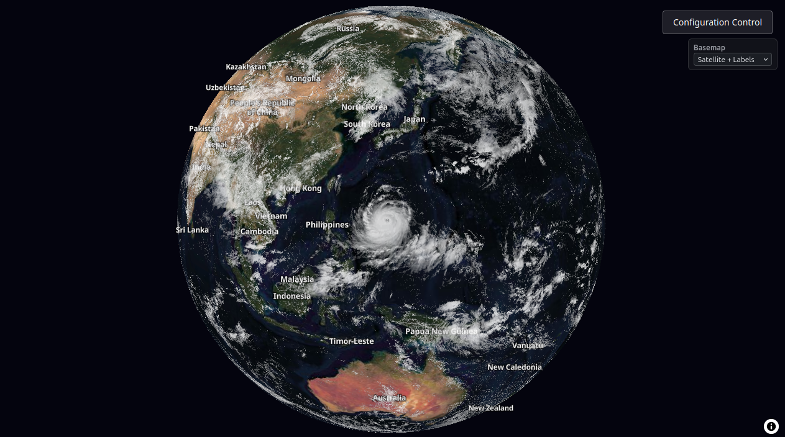

#### Precipitation
Often mis-labelled as rainfall, even though that's what it mostly is, it does also
cover snow, sleet, hail etc. It's probably one of the most interesting layers from
the point of view of the amateur meteorologist given it often affects our daily plans
in life! Given it can be displayed forecasted, it's quite useful in that regard.
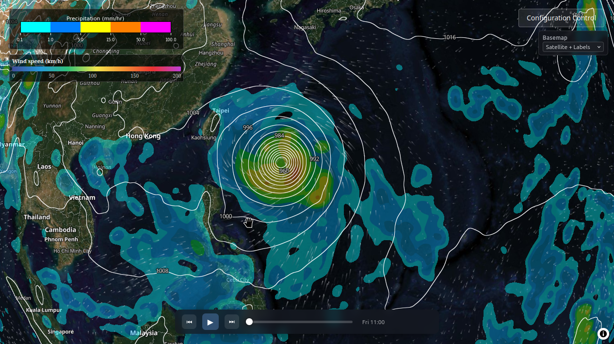

#### Precipitable Water
This shows the total amount of water vapour sitting in a column of atmosphere — not rain
itself, but the fuel that heavy rain and atmospheric rivers need. Rather than colourising
the whole globe, it only highlights potential problem areas: anywhere below a configurable
`Critical Moisture Threshold` is left transparent, and only the genuinely moist regions
above it get coloured, brightest where moisture is most extreme. By default it uses the
same colour palette as Precipitation, so the two layers visually reinforce each other when
shown together, though a couple of other palettes are available if you'd prefer something
distinct.
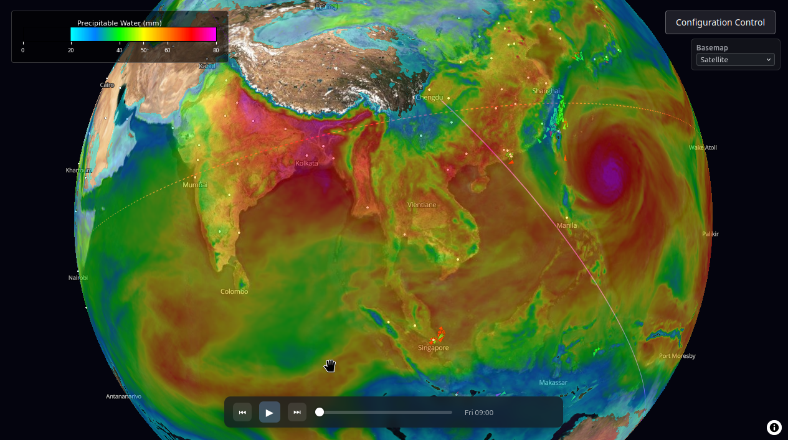

#### Isobars
The cornerstone of meteorology it shows what the pressure is doing in the atmosphere
and hence how the air masses are moving. Coupled with wind and precipitation
layers it really does show you how the weather is shaping up. Once again it can be
forecasted which makes it very useful. You can see examples of isobars in the Precipitation
image above.

#### Wind
Wind is depicted windy.com-style: animated flowing particle trails over a colourised
speed heatmap, so you can see both direction and intensity of the wind at a glance. This
layer is quite good paired with isobars where you can see the effect of differing air
pressure. If you want to see Precipitation at the same time as Wind then I recommend
you set `Heatmap opacity` of the underlying wind speed canvas to zero.
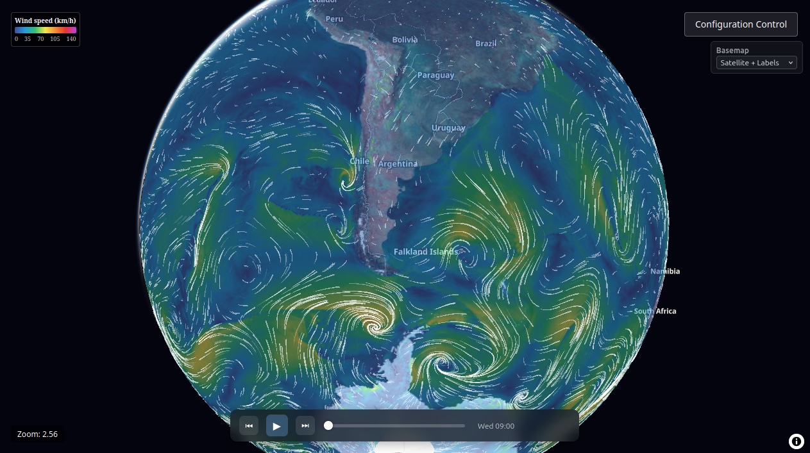

#### Storm Tracks
A storm is depicted as a track history followed by a prediction cone showing where
the storm might go next according to the computational models. You can hover over
the storm track to see its name and various other details.

To get the data we scan two sources:
* NHC (National Hurricane Center)
    Responsible for tracking storms in the North Atlantic (AL) and Eastern North
    Pacific (EP). Their servers also typically host data for the Central North
    Pacific (CP), which is technically handled by the CPHC in Hawaii.

* JTWC (Joint Typhoon Warning Center): This is a joint U.S. Navy and Air Force
    command responsible for tracking tropical cyclones everywhere else on Earth
    including the Western North Pacific (typhoons), the Indian Ocean, and the
    Southern Hemisphere.

The major advantage of the ATCF (Automated Tropical Cyclone Forecast) system is
that it's a shared standard. Even though the NHC and JTWC are entirely different
organizations with different jurisdictions, they both output their data using
the same comma-delimited columns.

There are a lot of configurable items on the panel for storms, so you can get
these looking how you like to see them.
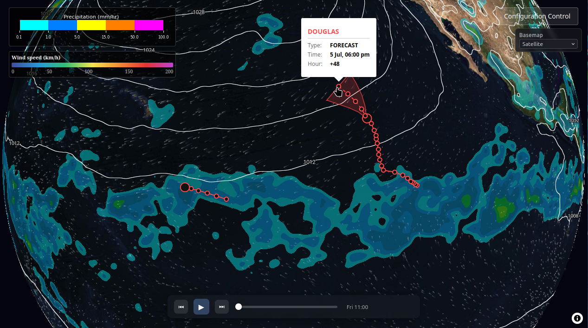

#### Lightning
Lightning strikes are of course very brief, so we need a shorter expiry for them to
avoid them building up and obliterating parts of the map. You have an `Expiry hours`
slider in the configuration panel for these to let you tune that. Having them show
for a few hours is good to see how clusters of them are forming in stormy weather.
We also have a colour code to give an idea of timing:
*  Strikes within the last 15 minutes
*  Within the last hour
*  Older than an hour (but not yet expired)
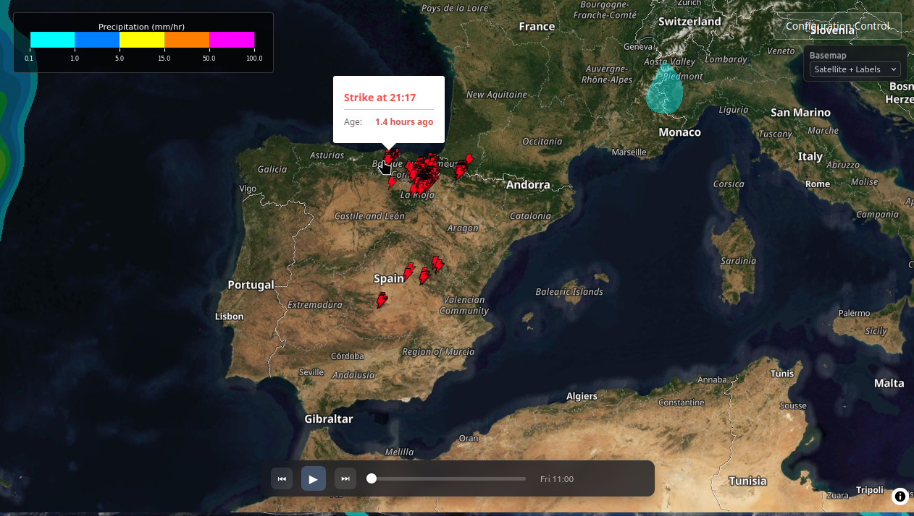

### Events
These are one-off events and cover Earthquakes and Volcanoes.

#### Earthquakes
These are one of the most interesting elements to put onto the map because it allows
you to visualise clusters of quakes appearing and providing a pattern of activity.
The symbol used comes in two colours, one for a very recent earthquake and one for
those older. You can set the `Recent activity hours` which determines this switch in
the configuration UI. The expiry hours can also be set there. Symbols:
*  Recent earthquake activity
*  Older earthquakes
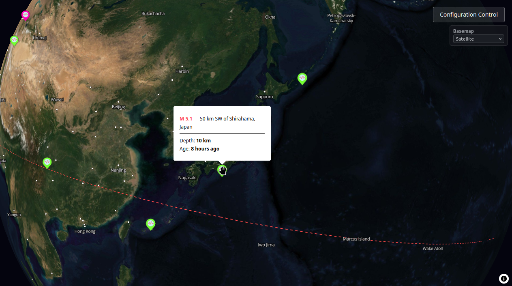

#### Volcanoes
Volcanoes are pretty much static, historical artifacts and can end up just cluttering
up the map, so I generally don't display them. There are also a lot of them, depending 
on which options you set in the configuration. Each volcano will appear on the map
as this symbol 

Useful if you want to research volcano activity in past times using the filtering
options. Obviously if one erupts in the present you can also view it, but the way
these things are catalogued isn't like Earthquakes and the filtering is crude.

#### Wildfires
If you have a [NASA FIRMS API Key](#nasa-firms-api-key) then you can enable the
`Wildfires` layer in the `Events` tab. The configuration settings for this allow you
to tune the underlying heatmap (showing fire risk) visibility, and also filter out
wildfire detections so the map isn't swamped with them. The satellite which is the
source of this data is simply measuring heat anomalies and the radiative power of
them, so it isn't a guarantee an actual fire is burning at that location. Position
is also fairly crude, being a 375 square meter area for each blob on the map.

That said it does provide a very interesting view of how dry the vegetation is across
the globe and hence how high the fire risk is, as well as highlighting areas where
fires are most probably burning. When you see a group of many together spread across
a line or in a cluster, there is a high probability is is a wildfire.
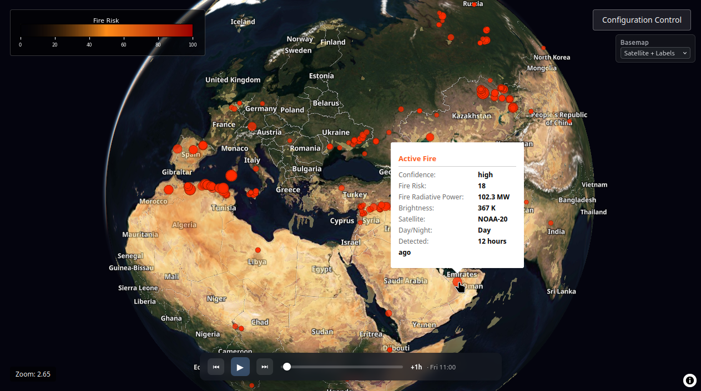

### Climate
This area is quite fascinating as it covers the entire planet. The data is sourced
from https://nomads.ncep.noaa.gov/ which contains a staggering amount of publicly
available data. Currently we are just dipping our toes in those waters and providing
Sea Surface Temperature, Air Temperature, Wave Heights, Ocean Currents and
the Ozone Layer data resolved to a 0.25 degree grid (with interpolation/smoothing
as required).

Each of Sea Surface Temperature, Ocean Currents, Wave Heights, Air Temperature, Ozone
and Storm Watch is mutually exclusive as a "climate base layer" — the `Show` tab presents
them as radio buttons rather than independent checkboxes, since they each colourise the
entire planet and having more than one on at once would just be a useless mashup of
overlapping colours. In fact use of these layers is best done with just about every other
colourising layer disabled — that would include Precipitation and Precipitable Water —
though for marker elements such as Earthquakes, Shipping etc it isn't so important.

#### SST
Sea Surface Temperature, sourced straight from NOAA's data. A fascinating visualisation
of what's happening across our oceans. Here is an example showing `Absolute SST`.
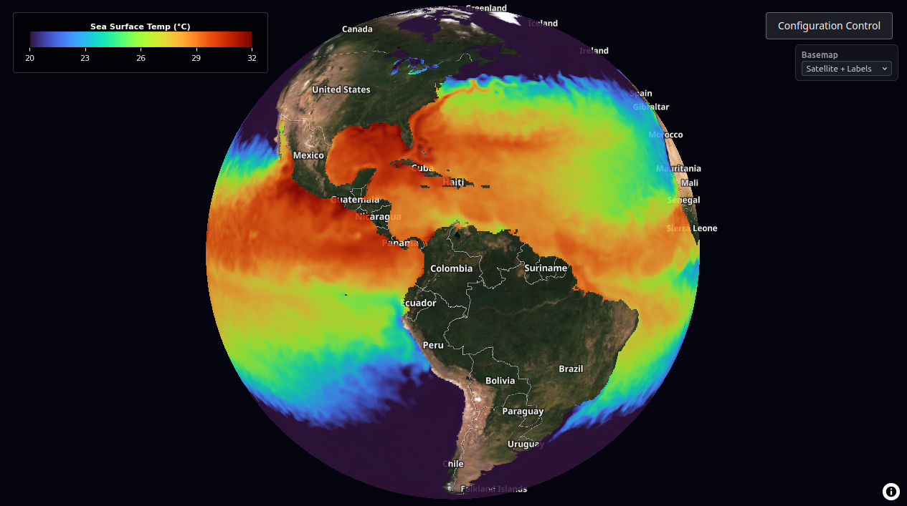
But there is another mode available `Anomaly SST` which shows the variation from historical
`normal` for sea surface temperature. Here's an example of that view:
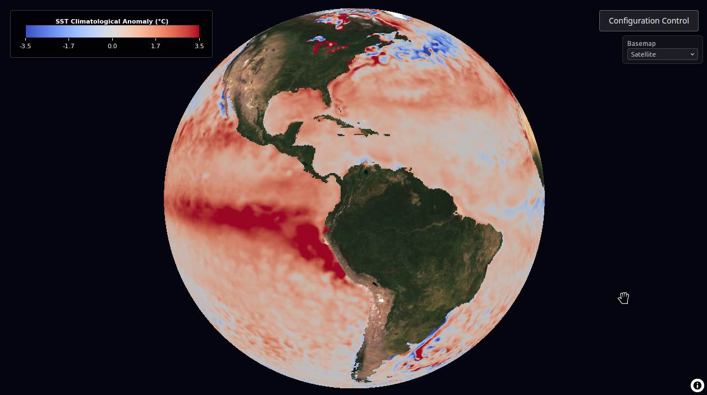

#### Air Temperature
Air/land temperatures are a measure of what's going on in our atmosphere, resolved
globally at the same grid resolution as everything else here.

#### Waves
This one is a colourisation depicting wave height across the planet. It gets quite
interesting when you watch waves interacting with a storm, or a tsunami eventuates
from an earthquake.
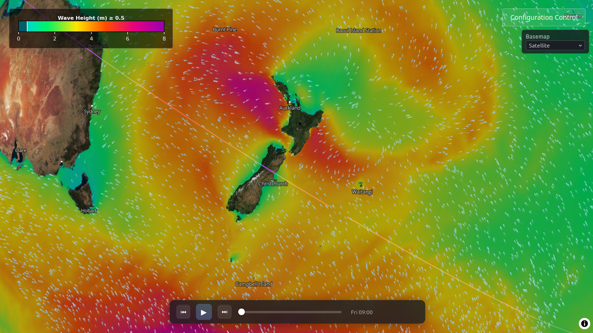

#### Ocean Currents
These are depicted as curves with arrows showing the flows going on in our oceans
on a real-time basis. This is one layer which could be shown together with others
such as Isobars, Clouds and Precipitation as it isn't a colouration layer.
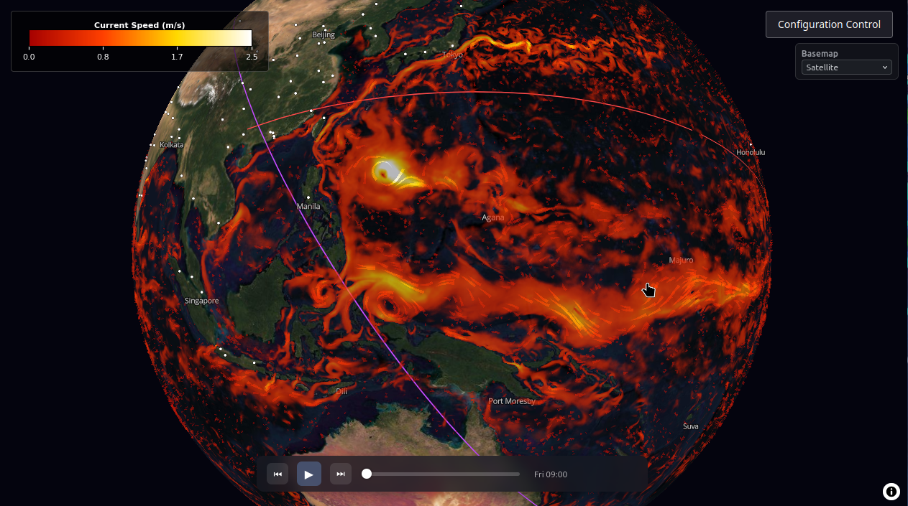

#### Ozone Layer
Another interesting climate layer to have a look at. There are a couple of palettes to
choose from, both built around a setting called `Critical Ozone Threshold`. The `du`
stands for "Dobson Units" which is what the ozone layer density is measured in. A value
of `220.0` is considered the threshold for a "hole" in the ozone layer. Any ozone reading
below that setting is coloured (brightest at the very worst readings), and anything above
it fades to a dim, near-transparent "safe" tone — so you only really see the problem areas.
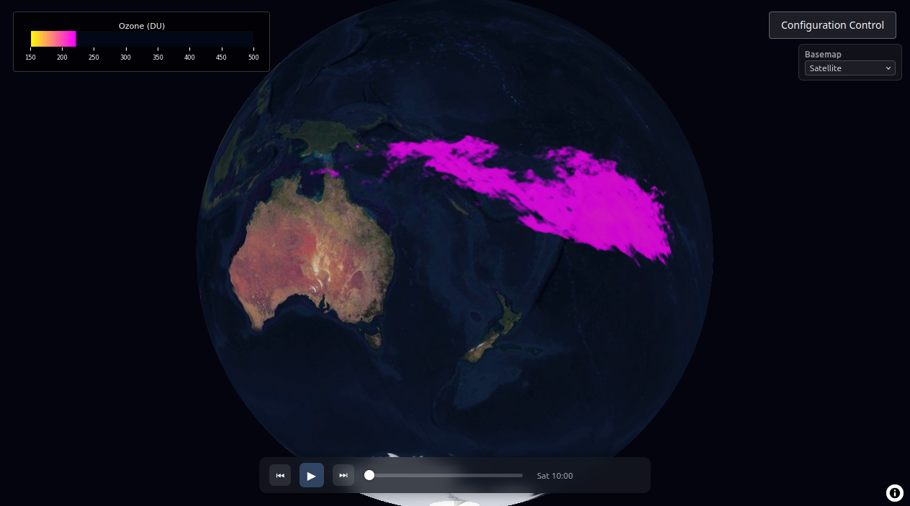

#### Storm Watch
This layer shows where there is a likelihood of a storm forming. It uses the CAPE
measurement (Convective Available Potential Energy) which, as the name suggests is
a value which expresses how much energy is available in the atmosphere, but it
also looks at the CIN (Convective Inhibition) measurement. CIN represents the
amount of energy required to overcome the negatively buoyant, stable "cap" or
"lid" in the lower atmosphere. It is essentially the barrier that a rising air
parcel must break through before it can tap into the CAPE (Convective Available
Potential Energy) above it. Combining both gives us a reasonable idea of the
actual potential for storm formation.
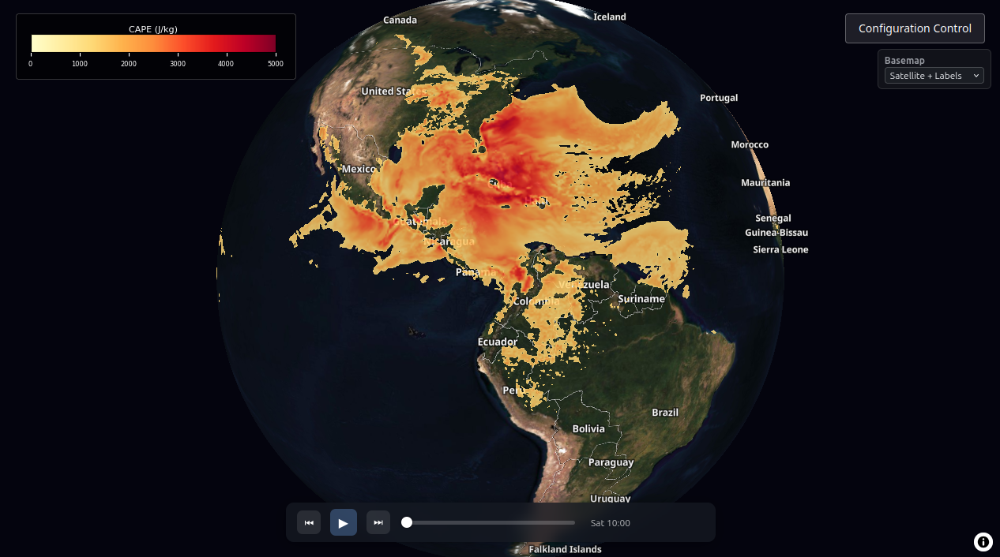

### Shipping
Ships are shown as small icons pointing in their current heading, colour-coded
by vessel type: red for tankers, green for cargo, and violet/purple for passenger and
other vessel types.
*  Tankers
*  Cargo
* 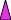 Passenger/other

Smaller vessels only appear once you're zoomed in reasonably close, with progressively
larger ones visible from further out — this keeps busy shipping lanes from turning into
an unreadable wall of icons at low zoom.
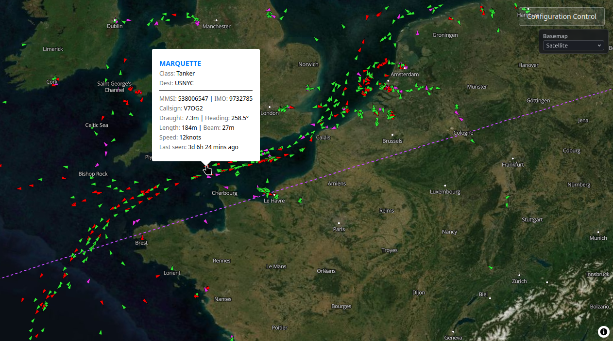

#### Shipping Data Acquisition
Ships broadcast data in the form of messages continuously at regular intervals. The main
message they emit is a `PositionReport` which contains information as to latitude and longitude,
current heading and speed. This message is usually fairly frequent. The other message of
interest to us is the `ShipStaticData` which has details of the ship itself such as name,
size, draught, type and IMO number (International Maritime Organization number). This message
is broadcast much less frequently, but the data is extremely useful to identify the type of
vessel and its current loading state (draught).

The `shipping_collector` listens for both types of message and will gradually populate your
database `ships` table with them. It does this by slicing the globe up into segments by
longitude, and then listening in each slice defined as a bounding box. The listen duration
varies according to how busy each slice is expected to be, based on shipping lanes and the
area of ocean it's looking at.

At any given instant either a `ShipStaticData` or `PositionReport` message might come in. If it's
a `PositionReport` the message is fairly specific to position, heading, speed etc. and contains
no details about the ship itself. The `shipping_collector` will look for an existing `ships`
record in our database with the same `mmsi` identifier, and if found add the new position info.
It also logs the position in the tracking table `ship_position` so we can display vessel tracks.
If it doesn't find an existing `ships` record it creates a `shadow` record with scant data about
the ship, basically just the name and the `mmsi` identifier. At some point we would hope to
back-fill that data when a `ShipStaticData` is acquired for it.

### Flight Radar
Live aircraft positions overlaid on the globe, sourced from [adsb.lol](https://adsb.lol)'s
free community ADS-B receiver network. Each aircraft is drawn as a simplified plane
silhouette — a distinct straight-wing shape for gliders/balloons/drones — tinted by
broad size/class, from near-white for widebody jets down to light blue for helicopters,
military types and anything unrecognised, and rotated to match its heading. Positions
are dead-reckoned smoothly from each aircraft's last known speed and track between
updates, rather than snapping every time fresh data arrives.

Hover over an aircraft for its flight number, aircraft type/class, airline (inferred
from the ICAO callsign for major/regional carriers — not shown for private/GA traffic,
which usually broadcasts its own registration as the callsign instead), registration, a
climb/descend/level/landed status, current altitude, the autopilot's selected target
altitude (once one is set and reachable), ground speed, heading and ICAO hex code. Like
Shipping, low-altitude and on-the-ground traffic only reveals itself once you're zoomed
in reasonably close, so busy airspace around major airports doesn't turn into a wall of
icons from further out.
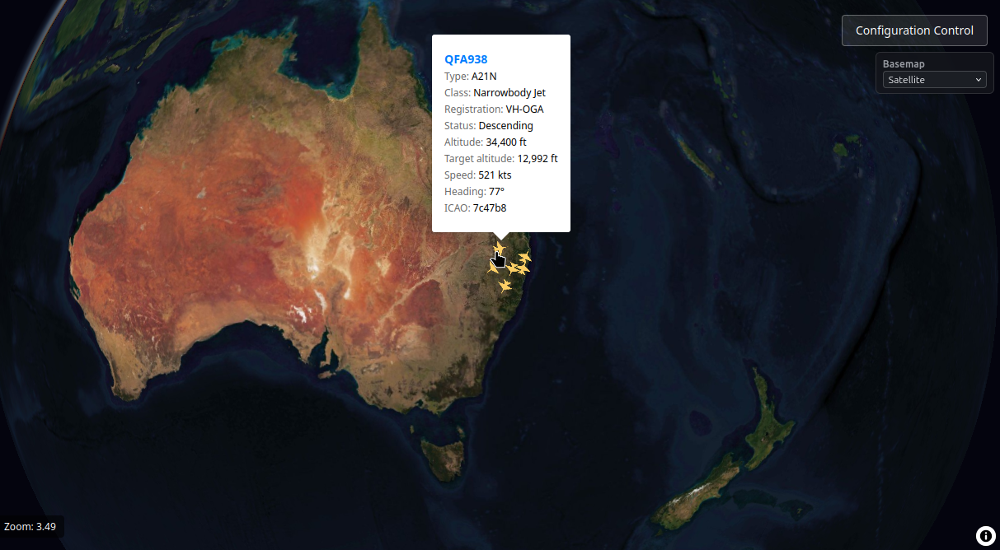

#### Flight Radar Data Acquisition
Unlike every other layer, Flight Radar isn't handled by the `data_collector` and nothing
is stored in the database for it — it's demand-driven, and only polled at all while the
layer is switched on and someone's actually looking. `map_api` runs a dedicated
WebSocket route your browser connects to directly: as you pan and zoom, your viewport is
mapped onto a coarse grid, and the backend polls adsb.lol on a shared timer per grid
cell, so however many browsers happen to be looking at roughly the same patch of sky,
adsb.lol only gets asked about it once. adsb.lol's free tier only tolerates a fairly
limited request rate, so the cell right under your view refreshes quicker than the
surrounding fill-in area around it.

### Data Collector
The data collector is a separate background process which collects data for:
* Quakes
* Storms
* Volcanoes
* Satellites
* SST
* GFS Atmos:
  * Isobars
  * Precipitation
  * Temperature
  * Ozone
  * Wind
  * Stormwatch
* Clouds
* Waves
* Currents
* Shipping
* Lightning
* Markers (Cities, Towns etc)

There is a status page in the configuration UI which shows the amount of data currently
collected, and also how much of that data has been crunched into front-end content. You
can also opt out of collecting data for them, depending on what you are interested in
seeing. Be aware though, that data generally takes some hours to collect, so if you
enable something don't expect to be seeing anything on the globe for a while. If you have
everything enabled the system is configured to be a light footprint in terms of remote
download requests, so all you scarifice there is some disk space. That said, if you are
genuinely never going to look at some of the data, it makes no sense to collect it.
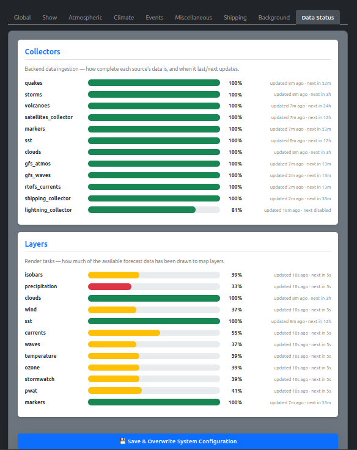

### Satellites
Plotting satellite paths is something that XPlanet did, and since that venerable project
inspired this one, we do it here too.

There are literally thousands of objects up there whizzing around the Planet, not to mention 
the mega-clusters like Starlink etc. so to keep things sane there's a multi-select with a 
handful of the most popular ones you can display.

There is also a text box for you to add a comma-separated list of satellite names to cater
for a few you want which aren't in the list. Just be aware any you add have to come from
the groups currently downloaded from Celestrak: `resource`, `science`, `stations`, and
`weather`. You can see what's in those by browsing to the following URL, replacing `{group}`
with one of those 4 group names:
    https://celestrak.org/NORAD/elements/gp.php?GROUP={group}&FORMAT=tle
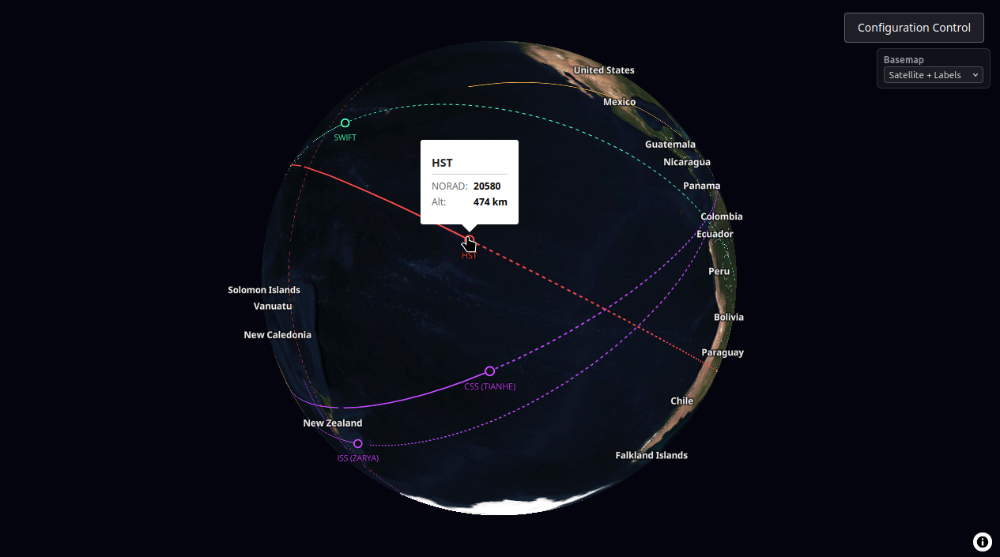

## Developer's Corner
If you want to tinker with the code (and maybe help improve it with some PRs) this
section aims to provide you with a few helpful instructions.

### Clone the Repository

    cd /your/preferred/workspace
    git clone -v https://github.com/paulwaite87/atmos-gl

After that, most things can be done via the Makefile. To see what is available:

    make help

Use `make up` to start up the stack with your local source bind-mounted in
(via `docker-compose.override.yml`) so code edits just need `make reload` to take effect —
no image rebuild required. `make build`/`make rebuild` are only needed for dependency or
Dockerfile changes.

### Control
Everything is managed through the Makefile.

    make up

Gets your stack running (an alias for `docker compose up -d`). And to stop it:

    make stop

Once running, browse to `http://localhost:8180` for the live globe.

If you change something in `config/atmos-gl.json` by hand rather than through the web UI,
or if you just want to restart the backend services:

    make reload

`make prod`/`make prod-down` do the same job as `atmos-gl.sh start`/`stop` — running exactly
as a package consumer would, against the published images rather than a local build.

### Logging
To tail the logs of everything:

    make logs

Or just one service:

    make logs service=layer_builder

See [Watching It Work](#watching-it-work) above for what a healthy log cycle looks like.

One useful command for shipping is:

    make status

That will print out some status info about ships in each region, ship totals and also lightning
strikes per region.

### Everything Else
`make test`, `make lint` and `make bash` are all there for you too — run `make help` for
the full list.

See `CLAUDE.md` at the repo root for the architectural conventions this project follows
(collector/render task layout, testing approach, git workflow) before diving in. Feel free
to clone the repo, update the code and give us a pull request!

### Regions
The database will be seeded with a few regions, which is a legacy thing from before this
project forked from `worldmap-desktop`. It serves no real purpose now except to provide
a breakdown of ships and lightning strikes per region when you do `./atmos-gl.sh status`.

However, if you want to add a region, we will need to get nerdy and insert data into your 
database. The format of an SQL statement which will do just that is:

    INSERT INTO map_region (label, boundary) VALUES ('My Region', ST_MakeEnvelope(-7.346384, 42.490591, 10.854976, 51.487329, 4326));

Copy this somewhere that you can change it in an editor.

For the coords, go to https://tools.mofei.life/bbox#1/0/0 and navigate to wherever is
centre of the region you want on the World map there. Zoom in and then pull a bounding-box
with SHIFT-drag. In the WGS84 box `Copy` the bounding box coords and paste those (minus 
the square brackets) into your INSERT.

The co-ordinate ordering is already correct. Give your INSERT a new appropriate label,
(replacing 'My Region', then copy that SQL statement onto your clipboard and execute
this command:

    docker compose exec atmos_gl_db psql -U agl atmos_gl

(If you've cloned the repo, `make psql` is a shortcut for this.)

That will get you into the Atmos GL database PSQL shell. Paste your INSERT into that and
hit enter. Bingo, a brand new region. The Atmos GL configurator should read your new region
and allow you to select it.

Just hit Ctrl-d to get out of the database.
